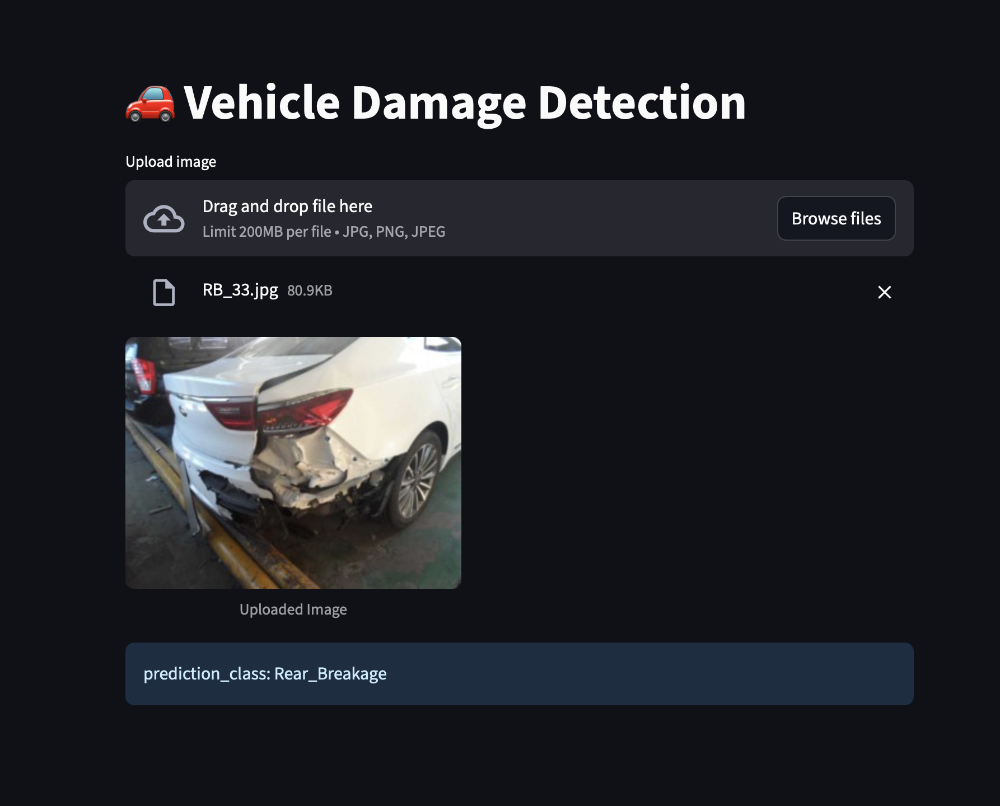

#  🚗 Vehicle Damage Detection

This project uses **Deep Learning (PyTorch)** to detect vehicle damages from images.  
It provides a **FastAPI backend** for model inference and a **Streamlit frontend** for user interaction.

## 📌 Features  
- **Model**: ResNet50 (Pretrained on ImageNet, Fine-tuned)  
- **Dataset**: 1700 images  
- **Classes**:  
  - Front_Breakage  
  - Front_Crushed  
  - Front_Normal  
  - Rear_Breakage  
  - Rear_Crushed  
  - Rear_Normal  
- **Accuracy**: 81%  
- **Deployment**: Streamlit Web App  
- **Backend**: FastAPI (optional for API service)

## 📸 Screenshot  

 

## ⚡ Setup & Run  

```bash
pip install -r requirements.txt

streamlit run app.py
